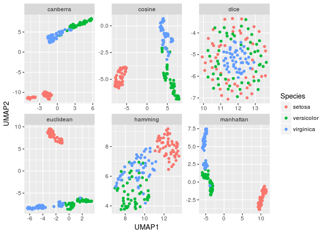

<!-- README.md is generated from README.Rmd. Please edit that file -->
umapr
=====

[](https://travis-ci.org/ropenscilabs/umapr)

`umapr` wraps the Python implementation of UMAP to make the algorithm accessible from within R.

Uniform Manifold Approximation and Projection (UMAP) is a non-linear dimensionality reduction algorithm. It is similar to t-SNE but computationally more efficient. UMAP was created by Leland McInnes and John Healy ([github](https://github.com/lmcinnes/umap), [arxiv](https://arxiv.org/abs/1802.03426)).

Installation
------------

You can install the development version from [GitHub](https://github.com/) with:

``` r
# install.packages("devtools")
devtools::install_github("ropenscilabs/umapr")
```

Basic use
---------

Here is an example of running UMAP on the `iris` data set.

``` r
library(umapr)
library(tidyverse)

# select only numeric columns
df <- iris[ , 1:4]

# run UMAP algorithm
embedding <- umap(df)
```

`umap` returns a `data.frame` with two attached columns called "UMAP1" and "UMAP2". These columns represent the UMAP embeddings of the data, which are column-bound to the original data frame.

``` r
# look at result
head(embedding)
#>   Sepal.Length Sepal.Width Petal.Length Petal.Width    UMAP1    UMAP2
#> 1          5.1         3.5          1.4         0.2 12.92441 4.082702
#> 2          4.9         3.0          1.4         0.2 11.72879 1.948935
#> 3          4.7         3.2          1.3         0.2 11.77402 2.604481
#> 4          4.6         3.1          1.5         0.2 11.68779 2.527600
#> 5          5.0         3.6          1.4         0.2 12.74414 3.944899
#> 6          5.4         3.9          1.7         0.4 14.13293 4.326360

# plot the result
embedding %>% 
  bind_cols(embedding, Species = iris$Species) %>%
  ggplot(aes(UMAP1, UMAP2, color = Species)) + geom_point()
```


There is a function called `run_shiny_app()` which will bring up a Shiny app for exploring different colors of the variables on the umap plots.

``` r
run_shiny_app(embedding)
```


Function parameters
-------------------

There are a few important parameters. These are fully described in the UMAP Python [documentation](https://github.com/lmcinnes/umap/blob/bf1c3e5c89ea393c9de10bd66c5e3d9bc30588ee/notebooks/UMAP%20usage%20and%20parameters.ipynb).

The `n_neighbor` argument can range from 2 to n-1 where n is the number of rows in the data.

``` r
neighbors <- c(4, 8, 16, 32, 64, 128)

f <- lapply(neighbors, function(neighbor) {
  iris_result <- umap(iris[, 1:4], n_neighbors = neighbor)
 
  cbind(iris_result, Species = iris$Species)
})

names(f) <- neighbors

bind_rows(f, .id = "Neighbor") %>% 
  mutate(Neighbor = as.integer(Neighbor)) %>% 
  ggplot(aes(UMAP1, UMAP2, color = Species)) + 
    geom_point() + 
    facet_wrap(~ Neighbor, scales = "free")
#> Warning: package 'bindrcpp' was built under R version 3.4.4
```


The `min_dist` argument can range from 0 to 1.

``` r
dists <- c(0.001, 0.01, 0.05, 0.1, 0.5, 0.99)

f <- lapply(dists, function(dist) {
  iris_result <- umap(iris[, 1:4], min_dist = dist)
  cbind(iris_result, Species = iris$Species)
})

names(f) <- dists

bind_rows(f, .id = "Distance") %>% 
  ggplot(aes(UMAP1, UMAP2, color = Species)) + 
    geom_point() + 
    facet_wrap(~ Distance, scales = "free")
```


The `distance` argument can be a bunch of stuff.

``` r
dists <- c("euclidean", "manhattan", "canberra", "cosine", "hamming", "dice")

f <- lapply(dists, function(dist) {
  iris_result <- umap(iris[,1:4], metric = dist)
  cbind(iris_result, Species = iris$Species)
})

names(f) <- dists

bind_rows(f, .id = "Metric") %>% 
  ggplot(aes(UMAP1, UMAP2, color = Species)) + 
    geom_point() + 
    facet_wrap(~ Metric, scales = "free")
```


